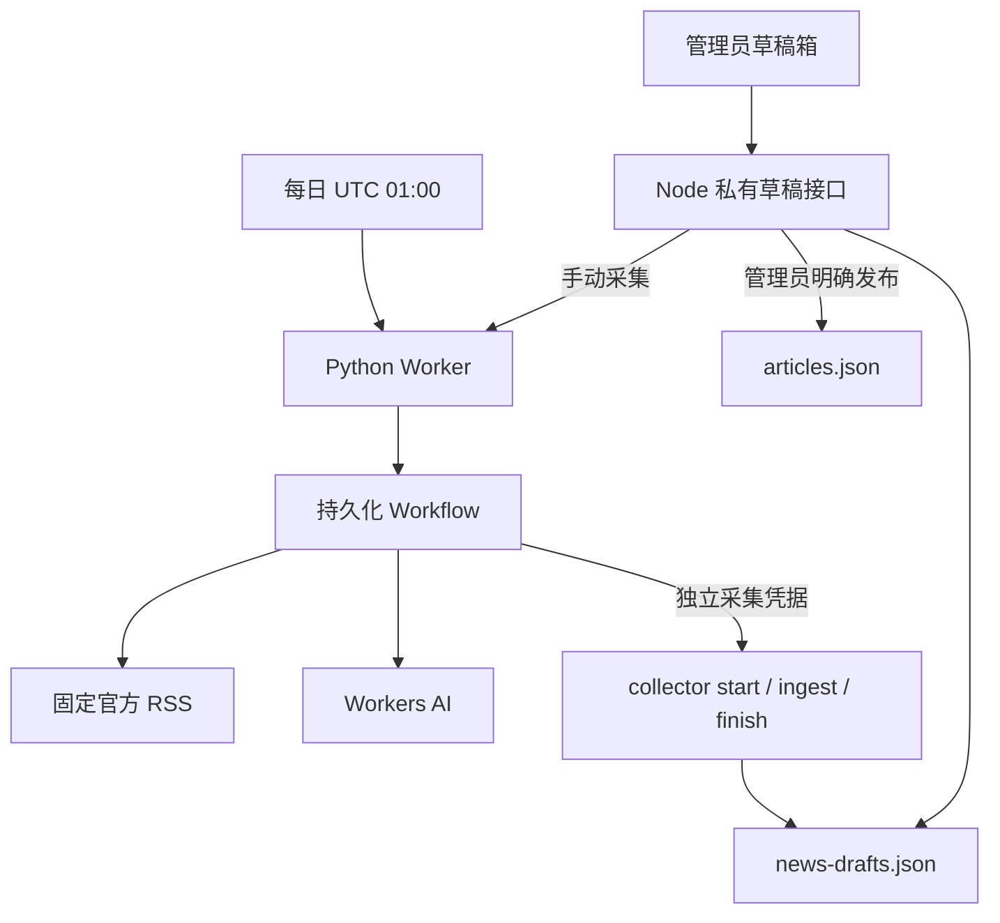
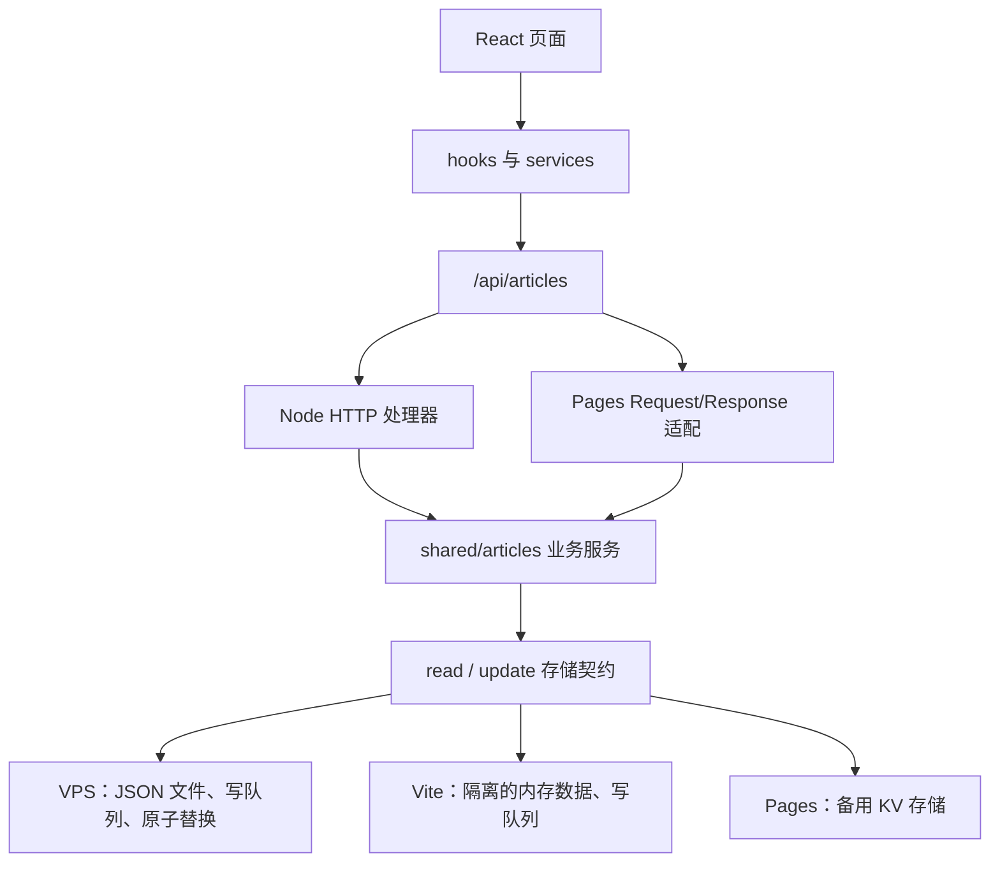

# 橘猫小窝架构与维护入口

## 资讯草稿箱（2026-09-22新增）

本地新增 `/admin/articles?tab=news`，与已有文章管理共用管理员登录。Python 采集器、草稿保存和公开文章发布各自独立；采集成功只增加私有草稿，管理员确认后才写入文章列表。当前处于实现与验收阶段，尚未完成线上部署验收；详细进度见 [NEWS_DRAFTS.md](NEWS_DRAFTS.md)。

### 新增模块与接口

| 位置 | 职责 |
| --- | --- |
| `workers/news-drafts/src/entry.py` | Cron / 手动触发、Workflow 分步执行、Workers AI 调用、结果回写 |
| `workers/news-drafts/src/news.py` | RSS 解析与来源约束、日期筛选、模型输入输出处理 |
| `shared/news-drafts/model.js` | 官方来源白名单、字段校验、UTC+8 每日 3 条额度与活动锁判断 |
| `shared/news-drafts/service.js` | 采集状态、来源去重、编辑/丢弃、幂等发布与来源署名 |
| `server/newsDraftStore.mjs` | 独立 JSON 文件、写队列、原子替换与 `.previous` 备份 |
| `server/newsDraftHandler.mjs` | 管理员和采集器两类鉴权、路由及错误映射 |
| `src/services/newsDrafts.js` | 同源私有草稿 API 请求；管理员密钥仅随请求传递 |
| `src/components/article-manager/NewsDraftPanel.jsx` | 采集与草稿状态、预览编辑、人工发布、有限轮询 |

管理端统一要求 `X-Admin-Key`，包括 `GET /api/news-drafts`。`POST /collect` 启动采集；`PUT /:id` 编辑；`DELETE /:id` 丢弃；`POST /:id/publish` 发布。采集器仅可通过独立 Bearer token 调用 `/collector`、`/collector/start`、`/collector/ingest`、`/collector/finish`，不能使用文章写接口。

### 状态与持久化边界

- 生产默认草稿文件为文章文件同目录下的 `news-drafts.json`，也可通过 `NEWS_DRAFTS_DATA_FILE` 指定。文章和草稿分别保存，普通文章查询没有草稿内容。
- 草稿状态为 `draft`、`published`、`dismissed`；丢弃项从管理列表隐藏，但保留原文 URL 和当日额度记录，避免再次采集。
- `collector` 保存开始/结束时间、服务端计数和任务 ID。活动锁有 20 分钟期限，过期以可重试错误展示；每条成功保存会更新活动时间。
- 发布先在文章文件写入并保留 `newsDraftId`，随后写草稿发布状态。若两次写入之间进程退出或响应丢失，重试复用同一篇文章。公开文章分类为 `AI 资讯`，追加官方来源与 AI 辅助整理说明。
- Worker `/run` 的 202 只表示 Workflow 已排队。前端保留最长 3 分钟的启动等待，首轮查询仍是旧状态时继续跟踪；每 5 秒查询一次，自动查询最多持续 3 分钟。超过等待时间或网络失败后保留草稿与状态，可手动刷新恢复。
- Markdown 预览使用局部错误边界。预览模块加载失败时仅显示预览错误，编辑内容、保存与其他管理操作保持可用，提示先保存再刷新。
- Vite 共用生产草稿处理器，草稿使用独立开发文件，文章依旧使用种子内存数据。测试发布的文章会随 Vite 重启重置；请指定独立测试草稿文件，避免将此行为误当生产持久化验收。
- Vite 接口契约测试为每个实例创建独立临时依赖缓存和草稿文件，避免与正在进行浏览器验收的开发服务器互相覆盖 `node_modules/.vite` 或草稿数据。
- 单进程文件写队列约束保持不变；本次没有给旧 Pages 备用 API 增加草稿功能。

生产服务需配置 `NEWS_WORKER_URL` 与 `NEWS_COLLECTOR_TOKEN_FILE`（或 `NEWS_COLLECTOR_TOKEN`）；Worker 使用相同 secret、`AI` 和 `NEWS_WORKFLOW` 绑定。仓库备份脚本已覆盖草稿文件，上线时仍需同步服务器已安装的脚本。部署 Python 采集器与真实采集验收详见 [采集器 README](../workers/news-drafts/README.md)。

## 2026-09-05 整理结果

文章 API 已拆为业务、接口、存储三层。本地开发、VPS 生产和 Pages 备用环境共用文章校验与增删改查；前端页面、路由、文章字段、管理密钥请求头、游戏存档及 JSON 数据格式保持兼容。本次架构调整已提交到 Git 仓库，发布准备与回滚记录见部署文档。

原先 `server/app.mjs` 同时处理 HTTP、鉴权和文章业务，并从 Pages 的 `functions/_shared` 导入规则；Vite 和 Pages 又各写了一套增删改查，造成校验不一致。现在业务规则集中在 `shared/articles`，平台代码单向依赖共享模块。

## 模块职责

| 位置 | 职责 | 修改时机 |
| --- | --- | --- |
| `shared/articles/model.js` | 字段规范化、必填规则、列表排序、ID 分配 | 新增文章字段或调整校验 |
| `shared/articles/service.js` | 查询、创建、部分更新、删除、时间字段与 ID 保护 | 修改文章业务行为 |
| `shared/articles/errors.js` | 可向客户端展示的预期错误及响应状态 | 新增业务错误 |
| `shared/articles/request.js` | 两个平台共用的 URL、方法覆盖与文章 ID 提取 | 调整接口兼容规则 |
| `server/http.mjs` | Node 请求体大小限制、JSON 编解码、密钥校验 | 修改 Node 传输规则 |
| `server/articleHandler.mjs` | HTTP 分发、健康检查、鉴权入口、错误映射 | 修改 VPS/Vite 接口行为 |
| `server/app.mjs` | 组装文件存储与 HTTP 服务 | 改换生产存储 |
| `server/articleStore.mjs` | 文件读写、串行写队列、原子替换与 `.previous` 备份 | 修改持久化实现 |
| `dev/memoryArticleStore.js` | 深拷贝隔离、内存写队列 | 修改本地临时数据存储 |
| `dev/viteMocks.js` | 挂载相同 Node 处理器，其余请求交回 Vite | 调整开发环境集成 |
| `functions/api/articles.js` | Pages 的 Web Request/Response 适配 | 修改备用平台接入 |
| `functions/_shared/articleStore.js` | 以 KV 实现同一存储接口 | 调整备用存储 |

`shared/articles/model.js` 和 `service.js` 不依赖 Node、React、Vite 或 Cloudflare；业务服务只通过注入的存储读写。`server` 不再反向依赖 `functions`；前端继续通过 HTTP 调用 API，不导入服务端存储或密钥。

## 存储契约与限制

- `read()` 返回文章数组快照。调用者修改快照不应改变已保存数据。
- `update(mutator)` 提供可修改的快照，回调返回 `{ articles, result }`，提交成功后返回 `result`。
- 回调失败时不提交数据；文件和内存实现的后续写入仍能继续。
- 文件与内存实现的串行队列只保证**同一个存储实例**内的写入隔离。当前部署保持单 Node 进程，不能用多个实例同时写同一 JSON 文件。
- Pages KV 仍是整表读改写，没有跨请求事务和并发写入保障。共用业务代码没有改变 KV 的一致性限制。
- Vite 每次启动使用 `shared/content/articlesSeed.js` 的深拷贝，编辑只保留在该开发服务器的内存中；重启恢复种子，生产数据不参与本地测试。

以后需要多人并发编辑或多进程运行时，可以新增数据库存储适配器，通过同一契约接入；具体事务保证仍由适配器实现。

## 接口兼容与收敛

保留 `/api/articles`、`?id=<id>`、`?id=auth-check`、`X-Admin-Key` 及 `POST + X-HTTP-Method-Override: PUT/DELETE`。Node/Vite 支持文章 ID 路径形式；Pages 处理函数也能解析该形式，但线上 Pages 的文件路由仍以查询参数为准。

本次有意统一的行为：

- 创建与更新都校验 `title`、`description`、`category`、`readTime`，空白字段返回 400。
- Vite 同样执行字段修剪、标签整理、作者默认值与创建/更新时间维护。
- JSON 格式错误、非对象载荷、非法方法覆盖返回 400；不支持的方法返回 405。
- ID 必须是正的安全整数；`1oops` 等值返回 400，避免 `parseInt` 截断后误读或误删其他文章。
- 多余路径段返回 404；部分更新保留原日期、正文、标签和创建时间，客户端不能改写 ID。
- Node/Vite 共用原有 2 MiB 请求体限制与同源策略，本地不再使用通配 CORS。Pages 保留原有 CORS 适配，未统一为 Node 流式请求体限制。
- 本地未设置 `DEV_ADMIN_KEY` 时公开读取可用，写入和登录校验返回“未配置密钥”的 500；配置后错误密钥返回 401。

旧 Pages 初始化函数保持原状，VPS 和 Vite 的共享处理器不挂载它。本次没有重新部署或启用备用站。

## 前端现状

`src/App.jsx` 负责按页面延迟加载，`src/pages/GameHub.jsx` 已对每个游戏分别延迟加载，独立雨姐分发页继续使用 Vite 多页面入口。文章数据访问位于 `src/services/articles.js`，请求状态位于 `src/hooks/useArticles.js`，展示和筛选逻辑仍在各自组件与工具模块中。本次没有移动前端文件或变更游戏数据。

## 发布与回滚

`deploy/auto-deploy.sh` 的 release 复制清单现在包含 `dist`、`server`、`shared`、`functions` 及包元数据；在切换 `current` 前以低权限账号导入 `server/app.mjs`，提前发现运行时依赖遗漏。Node 运行时没有新增第三方依赖。

**首次上线前需要同步服务器上已安装的发布脚本**（2026-09-05 已完成同步和备份）。systemd 使用的是 `/usr/local/sbin/orange-cat-blog-deploy`，不会自动执行仓库里的新版脚本；旧脚本漏复制 `shared` 会导致新版 API 启动失败。具体顺序见 [DEPLOYMENT.md](DEPLOYMENT.md#首次发布此次架构调整)。应用与文章文件格式兼容，仍可切回旧 release。

## 验证与进度

- 基线：69 项测试、lint、typecheck、生产构建通过。
- 新增三个环境共用的接口契约测试，覆盖鉴权、CRUD、规范化、部分更新、拒绝错误载荷后再次写入、非法 ID 和路径。
- 新增文件/内存存储测试，覆盖 20 次并发创建、失败恢复、快照隔离、磁盘备份与重开读取。
- 发布验证按脚本的实际复制清单生成临时 release，在没有 `node_modules` 的目录中验证模块导入、HTTP 健康检查、生产入口启动及 SIGTERM 正常退出。
- 最终：116 项测试、lint、typecheck、生产构建、差异空白与发布脚本语法检查通过；浏览器完成文章读取、登录、新建、列表刷新、正文和退出验收。详细检查与浏览器结果见 [CHANGELOG.md](CHANGELOG.md)。Pages 检查使用本地模拟 KV 调用真实函数，不代表已验收远端 Pages 部署。
