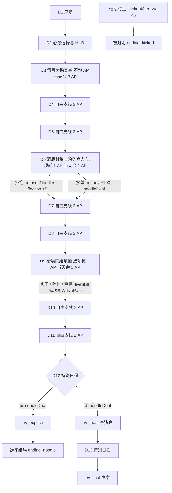
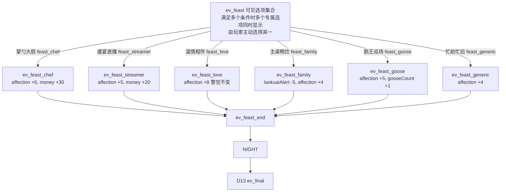
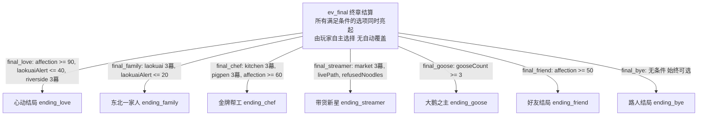

# 雨姐游戏流程图

版本：v2.3 验收版 / 当前实现

## 1. 全局游戏流程

## 2. D12 杀猪宴流程

## 3. D13 终章结局选择流程

## 4. 六支线列表

| 支线 ID | 地点名称 | 幕数 | 完成后是否可重复 |
| :--- | :--- | :--- | :--- |
| `kitchen` | 大厨房 | 3幕 | 是（可重复打工） |
| `pigpen` | 猪圈 | 3幕 | 否（不可重复） |
| `market` | 村口大集 | 3幕 | 否（不可重复） |
| `riverside` | 小河边 | 3幕 | 否（不可重复） |
| `laokuai` | 堂屋热炕 | 3幕 | 否（不可重复） |
| `mountain` | 后山 | 3幕 | 否（不可重复） |

## 5. D12 条件与收益表

| 选项 ID | UI 标题 | 触发与显示条件 | 结算收益 | 后续事件 |
| :--- | :--- | :--- | :--- | :--- |
| `feast_chef` | 掌勺大厨 | 完成 `kitchen` 和 `pigpen` 各 3 幕 | `affection +6`, `money +30` | `ev_feast_chef` |
| `feast_streamer` | 盛宴直播 | 完成 `market` 3 幕，并有 `livePath` 和 `refusedNoodles` | `affection +5`, `money +20` | `ev_feast_streamer` |
| `feast_love` | 温情相伴 | 完成 `riverside` 3 幕，`affection >= 75`, `laokuaiAlert <= 40` | `affection +8`，警觉不变 | `ev_feast_love` |
| `feast_family` | 主桌畅饮 | 完成 `laokuai` 3 幕，`laokuaiAlert <= 20` | `laokuaiAlert -5`, `affection +4` | `ev_feast_family` |
| `feast_goose` | 鹅王巡场 | `gooseCount >= 3` | `affection +5`, `gooseCount +1` | `ev_feast_goose` |
| `feast_generic` | 忙前忙后 | 无条件，永远显示 | `affection +4` | `ev_feast_generic` |

*注：D12 为可见选项集合机制，满足多个条件时多个专属选项会同时显示，玩家主动选择其一。六条短事件均流向 `ev_feast_end` -> `NIGHT` -> D13 `ev_final`。*

## 6. 九结局列表

| 结局 ID | 结局名称 | 触发条件 / 达成路径 |
| :--- | :--- | :--- |
| `ending_love` | 心动结局 | D13 选项 `final_love`：`affection >= 90`, `laokuaiAlert <= 40`, 完成 `riverside` 3 幕 |
| `ending_family` | 东北一家人 | D13 选项 `final_family`：完成 `laokuai` 3 幕，`laokuaiAlert <= 20` |
| `ending_chef` | 金牌帮工 | D13 选项 `final_chef`：完成 `kitchen` 和 `pigpen` 各 3 幕，`affection >= 60` |
| `ending_streamer` | 带货新星 | D13 选项 `final_streamer`：完成 `market` 3 幕，并有 `livePath` 和 `refusedNoodles` |
| `ending_goose` | 大鹅之主 | D13 选项 `final_goose`：`gooseCount >= 3` |
| `ending_friend` | 好友结局 | D13 选项 `final_friend`：`affection >= 50` |
| `ending_bye` | 路人结局 | D13 选项 `final_bye`：无条件，始终可选 |
| `ending_noodle` | 翻车结局 | D6 接单获 `noodleDeal`，D12 触发 `ev_expose` 达成 |
| `ending_kicked` | 被赶走 | 全局任意时点只要 `laokuaiAlert >= 45` 立即达成 |

## 7. 关键一致性结论

全流程状态流转、数值阈值与分支逻辑保持严格一致：任意时点老蒯警觉度只要满足 `laokuaiAlert >= 45` 立即强制进入 `ending_kicked`；D12 与 D13 均采用“条件可见选项集合”设计，当玩家达成多个支线与数值门槛时，所有符合条件的专属选项将同时亮起呈现，完全由玩家主动选择，不存在自动覆盖；全流程九大结局与六大支线严格依据上述条件表判定与结算。
