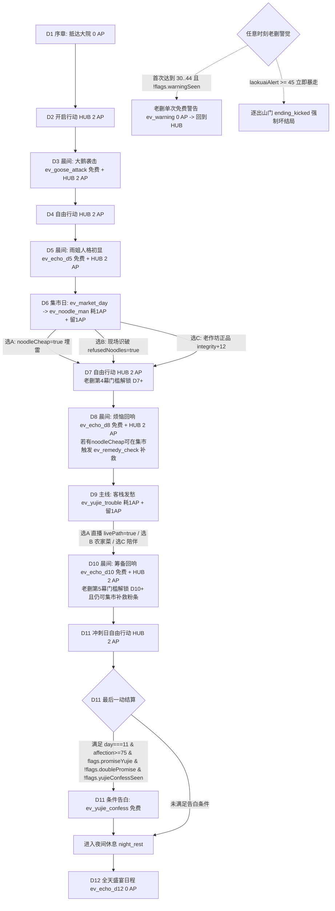
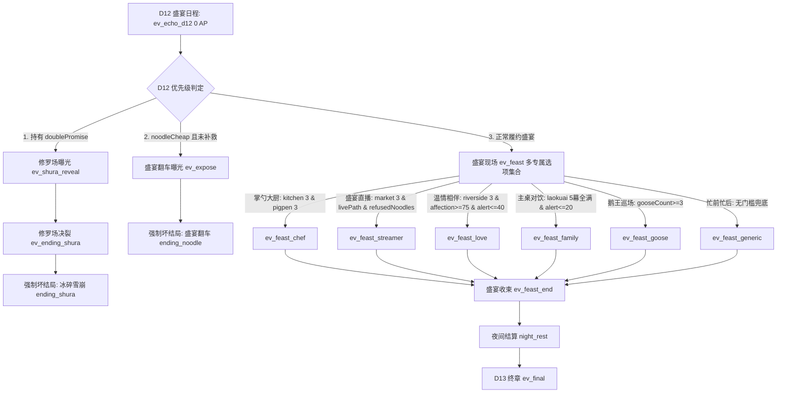

# 雨姐游戏流程图

版本：v2.4 本地实现版（待发布）

> 注：本流程图基于本地已实现的 v2.4 架构规范（包含 62 节点、145 对白、147 选项、35.37% 风险/混合选项比、14 大结局及真实 18 AP 消耗模型），当前仅为本地完成状态，尚未正式线上发布。

---

## 1. 全局日程与 AP 消耗流转（D1 - D13，真实 18 AP）

全局 AP 分布总计严格为 **18 AP**：
- **D1 序章**: 0 AP（线性引导）
- **D2 / D3 / D4 / D5**: 各 2 AP（D3 晨间大鹅突袭 `ev_goose_attack` 免费，当天仍有 2 AP 自由行动；D5 晨间雨姐人格回响 `ev_echo_d5` 免费，留 2 AP）
- **D6 集市日**: 1 AP（固定主线 `ev_market_day` 耗 1 AP，当天剩余 1 AP）
- **D7 / D8 / D10 / D11**: 各 2 AP（D8 晨间回响 `ev_echo_d8` 免费留 2 AP；D10 晨间回响 `ev_echo_d10` 免费留 2 AP；D11 冲刺日结算后满足条件触发条件告白 `ev_yujie_confess`）
- **D9 主线发愁**: 1 AP（主线 `ev_yujie_trouble` 耗 1 AP，当天剩余 1 AP）
- **D12 盛宴日程**: 0 AP（全天专场事件 `ev_echo_d12` -> 盛宴分支，无自由行动）
- **D13 终章结算**: 0 AP（`ev_final` 汇总选择结局）



---

## 2. HUB 行动与单次 AP 语义说明

在 HUB 自由行动期间，每次选择进入普通路线或触发特殊插曲均由 UI 预扣且严格遵循 **单次 1 AP 扣减语义**：
- **普通地点路线**：`kitchen`（3幕+可重复打工）、`pigpen`（3幕）、`market`（3幕）、`riverside`（3幕）、`laokuai`（5幕：第4幕需 D7+，第5幕需 D10+）、`mountain`（3幕）。每次行动消耗 1 AP，推进对应幕数或产出。
- **特殊插曲节点（UI 预扣且各占 1 AP 自由行动）**：
  - `ev_cuihua_market`（集市特殊插曲，获得 `cuihuaHelp` 增益）；
  - `ev_peisi_help`（厨房/盛宴协力插曲）；
  - `ev_goose_deep`（后山大鹅领地插曲，确立 `gooseAlly`）；
  - `ev_repair_laokuai`（老蒯关系修复插曲，化解警觉并增进羁绊）；
  - `ev_river_night`（河边夜捕密语插曲）；
  - `ev_remedy_check`（D8/D10 持有劣质粉条 `noodleCheap` 时在集市触发，消耗 1 AP 完成补救消除翻车隐患）。
- **免费即时插曲（0 AP）**：
  - `ev_warning`：当 `laokuaiAlert` 处于 `[30, 44]` 区间且 `!flags.warningSeen` 时自动免费插入，老蒯当面严厉警告杰克，随后返回 HUB；
  - `ev_yujie_confess`：D11 最后一动消耗完毕后，满足 `day === 11 && affection >= 75 && flags.promiseYujie && !flags.doublePromise && !flags.yujieConfessSeen` 门槛，在进入 `night_rest` 前免费触发。

---

## 3. D12 盛宴判定优先级与流程

D12 晨间以人格回响 `ev_echo_d12` 启动，并按以下严格优先级分流，无自由 AP：
1. **最高优先级（修罗场）**：若持有双重承诺（`doublePromise === true`），强制分流至 `ev_shura_reveal` -> 剧情事件 `ev_ending_shura` -> 强制坏结局 `ending_shura`。
2. **次高优先级（粉条翻车）**：若持有劣质粉条且未在 D8/D10 补救（`noodleCheap && !noodleRemedied`），强制分流至劣质粉条曝光 `ev_expose` -> 强制坏结局 `ending_noodle`。
3. **正常盛宴主干**：正常进入 `ev_feast` 盛宴现场，依据玩家达成的路线与条件分流至对应专属盛宴事件：
   - `ev_feast_chef`：`kitchen` 与 `pigpen` 均完成 3 幕；
   - `ev_feast_streamer`：`market` 完成 3 幕，且 `flags.livePath` 与 `flags.refusedNoodles`；
   - `ev_feast_love`：`riverside` 完成 3 幕，且 `affection >= 75`，`laokuaiAlert <= 40`；
   - `ev_feast_family`：`laokuai` 完成全部 5 幕，且 `laokuaiAlert <= 20`；
   - `ev_feast_goose`：`gooseCount >= 3`（此处不要求 `gooseAlly`）；
   - `ev_feast_generic`：无门槛通用兜底。
   各专属事件均直接汇入 `ev_feast_end` -> `night_rest` -> 顺利过渡至 D13。



---

## 4. D13 终章 14 大结局全景分类与触发矩阵

D13 终章 `ev_final` 采用“所有满足条件选项同时亮起，由玩家主动选择”的呈现机制。全游戏共 14 个结局 ID，结构化归类如下：

```mermaid
flowchart TD
    ev_final[D13 ev_final 终章选择<br/>所有满足门槛的选项同时亮起，由玩家主动抉择]

    subgraph 雨姐三大爱情分支
        ev_final -->|final_love: 势均力敌 yujieSoftness[-10,10]| ending_love[炊烟并蒂 ending_love]
        ev_final -->|final_love_soft: 倚怀依恋 yujieSoftness > 10| ev_ending_love_soft[专属剧情] --> ending_love_soft[倚怀向晚 ending_love_soft]
        ev_final -->|final_love_power: 强势庇护 yujieSoftness < -10| ev_ending_love_power[专属剧情] --> ending_love_power[盛木为荫 ending_love_power]
    end

    subgraph 老蒯羁绊分支
        ev_final -->|final_laokuai_soulmate: laokuaiBond>=55, routes.laokuai>=5, romance<35| ev_ending_laokuai_soulmate[专属剧情] --> ending_laokuai_soulmate[匠心同舟 ending_laokuai_soulmate]
        ev_final -->|final_laokuai_romance: romance>=50, routes.laokuai>=4, mutualConsent| ev_ending_laokuai_romance[专属剧情] --> ending_laokuai_romance[默契生温 ending_laokuai_romance]
    end

    subgraph 大院功能与普通分支
        ev_final -->|final_family: routes.laokuai>=3, alert<=20, bond>=30, affection>=50| ending_family[东北一家人 ending_family]
        ev_final -->|final_chef: routes.kitchen>=3, routes.pigpen>=3, affection>=60, integrity>=10| ending_chef[关东名厨 ending_chef]
        ev_final -->|final_streamer: routes.market>=3, livePath, refusedNoodles| ending_streamer[顶流之星 ending_streamer]
        ev_final -->|final_goose: gooseCount>=3 且 gooseAlly| ending_goose[鹅中霸王 ending_goose]
        ev_final -->|final_friend: affection>=50 友好门槛| ending_friend[农家挚友 ending_friend]
        ev_final -->|final_bye: 无任何门槛 永远可选| ending_bye[客路匆匆 ending_bye]
    end

    subgraph 强制坏结局三项（非D13主动选择）
        D12_Shura[D12 doublePromise] --> ending_shura[冰碎雪崩 ending_shura]
        D12_Noodle[D12 noodleCheap 未补救] --> ending_noodle[盛宴翻车 ending_noodle]
        Anytime_Alert[任意时刻 alert>=45] --> ending_kicked[逐出山门 ending_kicked]
    end
```

### 14 结局全景判定矩阵表

| 结局 ID | 结局名称 | 分组类别 | 触发时机 / 方式 | 精确达成条件 |
| :--- | :--- | :--- | :--- | :--- |
| `ending_love` | 炊烟并蒂 | 雨姐爱情 (势均力敌) | D13 主动选 `final_love` | `affection >= 90` 且 `laokuaiAlert <= 40` 且 `routes.riverside >= 3` 且 `yujieSoftness` 在 `[-10, 10]` 且 `promiseYujie` 且无 `doublePromise` |
| `ending_love_soft` | 倚怀向晚 | 雨姐爱情 (温婉依恋) | D13 主动选 `final_love_soft` | `affection >= 90` 且 `laokuaiAlert <= 40` 且 `routes.riverside >= 3` 且 `yujieSoftness > 10` 且 `promiseYujie` 且无 `doublePromise` |
| `ending_love_power` | 盛木为荫 | 雨姐爱情 (强势庇护) | D13 主动选 `final_love_power` | `affection >= 90` 且 `laokuaiAlert <= 40` 且 `routes.riverside >= 3` 且 `yujieSoftness < -10` 且 `promiseYujie` 且无 `doublePromise` |
| `ending_laokuai_soulmate` | 匠心同舟 | 老蒯知己 | D13 主动选 `final_laokuai_soulmate` | `laokuaiBond >= 55` 且 `routes.laokuai >= 5` 且 `laokuaiRomance < 35` 且 `laokuaiAlert <= 20` 且无 `doublePromise` |
| `ending_laokuai_romance` | 默契生温 | 老蒯浪漫 | D13 主动选 `final_laokuai_romance` | `laokuaiRomance >= 50` 且 `laokuaiBond >= 35` 且 `routes.laokuai >= 4` 且 `mutualLaokuaiConsent` 且 `laokuaiAlert <= 20` 且无 `doublePromise` |
| `ending_family` | 东北一家人 | 大院家族 | D13 主动选 `final_family` | `routes.laokuai >= 3` 且 `laokuaiAlert <= 20` 且 `laokuaiBond >= 30` 且 `affection >= 50` |
| `ending_chef` | 关东名厨 | 技艺传承 | D13 主动选 `final_chef` | `routes.kitchen >= 3` 且 `routes.pigpen >= 3` 且 `affection >= 60` 且 `integrity >= 10` |
| `ending_streamer` | 顶流之星 | 助农带货 | D13 主动选 `final_streamer` | `routes.market >= 3` 且 `livePath === true` 且 `refusedNoodles === true` 且无粉条危机 |
| `ending_goose` | 鹅中霸王 | 驯兽奇遇 | D13 主动选 `final_goose` | `gooseCount >= 3` 且 `gooseAlly === true` |
| `ending_friend` | 农家挚友 | 普通友好 | D13 主动选 `final_friend` | `affection >= 50` |
| `ending_bye` | 客路匆匆 | 通用告别 | D13 主动选 `final_bye` | **无门槛**，永远常驻显示供玩家兜底退出 |
| `ending_shura` | 冰碎雪崩 | 强制坏结局 | D12 盛宴强制触发 | `doublePromise === true`（同时欺瞒老蒯与雨姐） |
| `ending_noodle` | 盛宴翻车 | 强制坏结局 | D12 盛宴强制触发 | `noodleCheap === true` 且未在 D8/D10 补救 |
| `ending_kicked` | 逐出山门 | 强制坏结局 | 任意时刻即时触发 | `laokuaiAlert >= 45`（老蒯戒备值溢出） |

---

## 5. 内容规模预算、手记与存档兼容性

### 5.1 节点与分支规模
- **节点规模**：全剧本严格由 **62 个节点** 组成（保留并更新 42 个既有节点，新增 20 个功能与插曲节点）。
- **文本与选项规模**：全量包含 **145 条对白 / 叙述段落** 与 **147 个分支选项**。
- **风险选项配比**：带有负面、警觉激化或混合后果的选项占比为 **35.37%**（52 个风险/混合/负面选项），彻底摒弃纯数值正向刷分。

### 5.2 阶段词与二周目手记机制
- **首周目体验**：主界面及选项反馈采用沉浸式“阶段词”（如 *雨姐眼神微动*、*老蒯默默抽了口旱烟*），不外露冰冷裸数值。
- **二周目精确手记**：通关任意结局后解锁二周目手记面板，玩家可实时查阅好感度、柔和度、老蒯羁绊/浪漫值、警觉度等精确数值与判定分支走向。

### 5.3 旧存档迁移契约（`migrateStats`）
引擎加载存档时自动执行 `migrateStats(state)`，保证旧版本（v2.3 及更早）存档向 v2.4 平滑过渡：
- 顶层数值与进度字段严格保持：`day`, `actionPoints`, `affection`, `laokuaiAlert`, `yujieSoftness`, `laokuaiBond`, `laokuaiRomance`, `integrity`, `routes` 等；
- `flags` 保持在 `stats.flags` 内并整体保留/浅拷贝（当 `source.flags` 为对象时浅拷贝整个对象，否则使用初始 `{}`），缺失 flags 按读取端的布尔语义自然视作 `false`，绝不将 flags 提升混杂至 stats 顶层；
- `items` 浅拷贝，`historyLog` 深拷贝。
